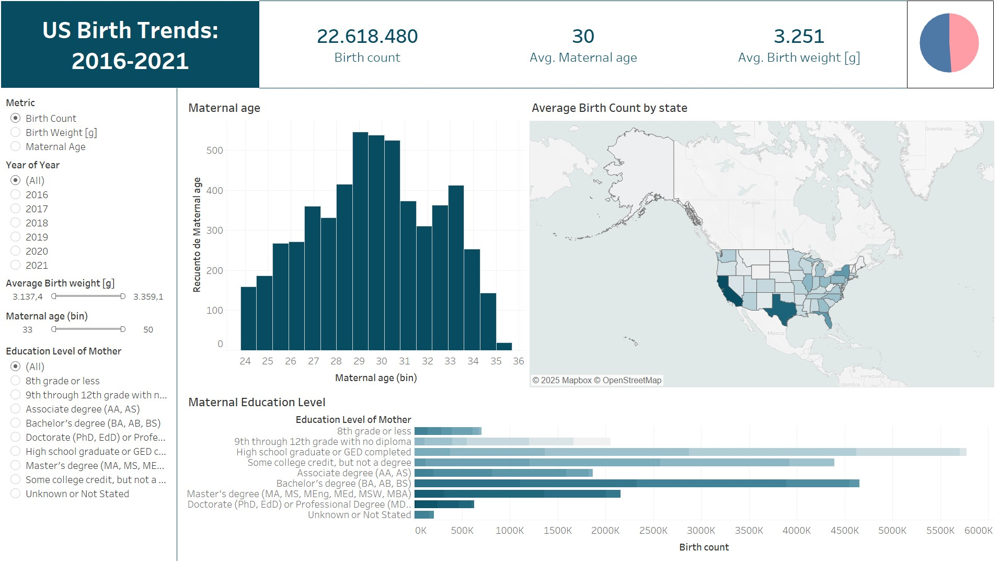

# Tableau projects

This repository contains my visualizations and analyses created using Tableau. You can find the interactive dashboards in my [Tableau Public](https://public.tableau.com/app/profile/rosa.micaela.serra/vizzes) profile.

## US Birth Trends: 2016-2021

This project visualizes births in the US by year, state, and mother's education level, from 2016 to 2021. The data source is a Kaggle dataset available [here](https://www.kaggle.com/datasets/danbraswell/temporary-us-births). The project aims to:

* Visually represent the three key metrics: birth count, birth weight, and maternal age per state.
* Analyze maternal education levels at the time of birth.
* Identify the most common age for childbirth in the US.

Key visualizations include:

* An interactive map displaying the three main metrics.
* A histogram visualizing the distribution of maternal age.
* A chart depicting the number of births by maternal education level.

## British Airway Reviews

This project focuses on creating visualizations to analyze different customer rating metrics for British Airways. The primary objective is to illustrate how these ratings vary across different routes and over time. The key metrics examined include:
* Overall rating
* Cabin staff service
* Entertainment
* Food and beverage service
* Ground service

Key visualizations include:

* Interactive map: Displays the distribution of ratings across various destinations, allowing for interactive exploration.
* Trend analysis: Illustrates how each rating metric has changed over time.
* Aircraft-specific ratings: Shows how ratings vary across different aircraft models.

